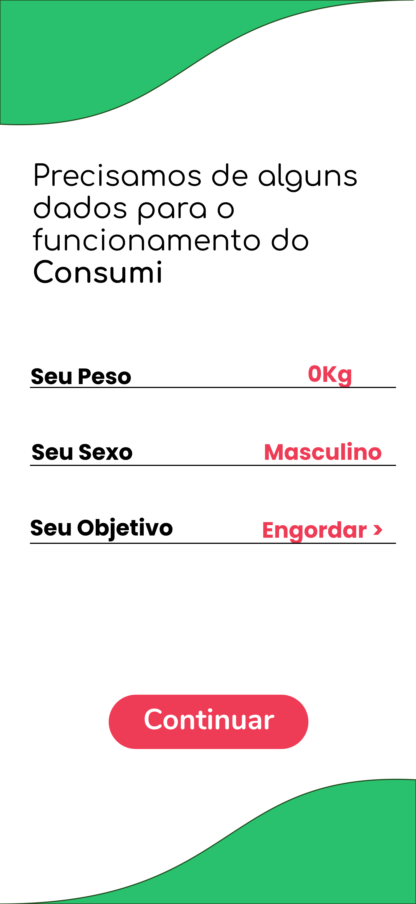

[![Contributors][contributors-shield]][contributors-url]
[![Commits][commits-shield]][commits-url]
[![Forks][forks-shield]][forks-url]
[![Stargazers][stars-shield]][stars-url]
[![Issues][issues-shield]][issues-url]

<!-- PROJECT LOGO -->
 

  

  <h3 align="center">Consumi</h3>

  

    O aplicativo é uma calculadora voltada para rastrear o consumo calórico diário e analisar se sua meta está sendo alcançada. 
     
    <a href="https://github.com/DaniloLira/Consumi"><strong>Explore a documentação »</strong></a>
     
     
    <a href="https://github.com/DaniloLira/Consumi">TestFlight</a>
    ·
    <a href="https://github.com/DaniloLira/Consumi">Reporte Bug</a>
  

<!-- TABLE OF CONTENTS -->
## Tabela de conteúdo

* [Sobre o projeto](#sobre-o-projeto)
* [Tecnologias utilizadas](#tecnologias-utilizadas)

<!-- ABOUT THE PROJECT -->
## Sobre o projeto
O Consumi é meu primeiro aplicativo iOS e utilizei ele pra aprender diversos conceitos como a utilização do storyboard e como são feitas as operações mais simples na linguagem swift.

| Home | Cadastrar | Registrar |
|----------|----------|----------|
|   |    |    |

### Tecnologias utilizadas
Aqui listamos as tecnologias utilizadas para a construção deste projeto
* [Swift](https://swift.org/)

<!-- MARKDOWN LINKS & IMAGES -->
<!-- https://www.markdownguide.org/basic-syntax/#reference-style-links -->
[contributors-shield]: https://img.shields.io/github/contributors/DaniloLira/Consumi.svg?style=flat-square
[contributors-url]: https://img.shields.io/github/contributors/DaniloLira/Consumi
[forks-shield]: https://img.shields.io/github/forks/DaniloLira/Consumi.svg?style=flat-square
[forks-url]: https://img.shields.io/github/forks/DaniloLira/Consumi
[commits-shield]: https://img.shields.io/github/last-commit/DaniloLira/Consumi.svg?style=flat-square
[commits-url]: https://img.shields.io/github/last-commit/DaniloLira/Consumid
[stars-shield]: https://img.shields.io/github/stars/DaniloLira/Consumi.svg?style=flat-square
[stars-url]: https://img.shields.io/github/stars/DaniloLira/Consumi
[issues-shield]: https://img.shields.io/github/issues/DaniloLira/Consumi.svg?style=flat-square
[issues-url]: https://img.shields.io/github/issues/DaniloLira/Consumi
[product-screenshot]: images/screenshot.png
